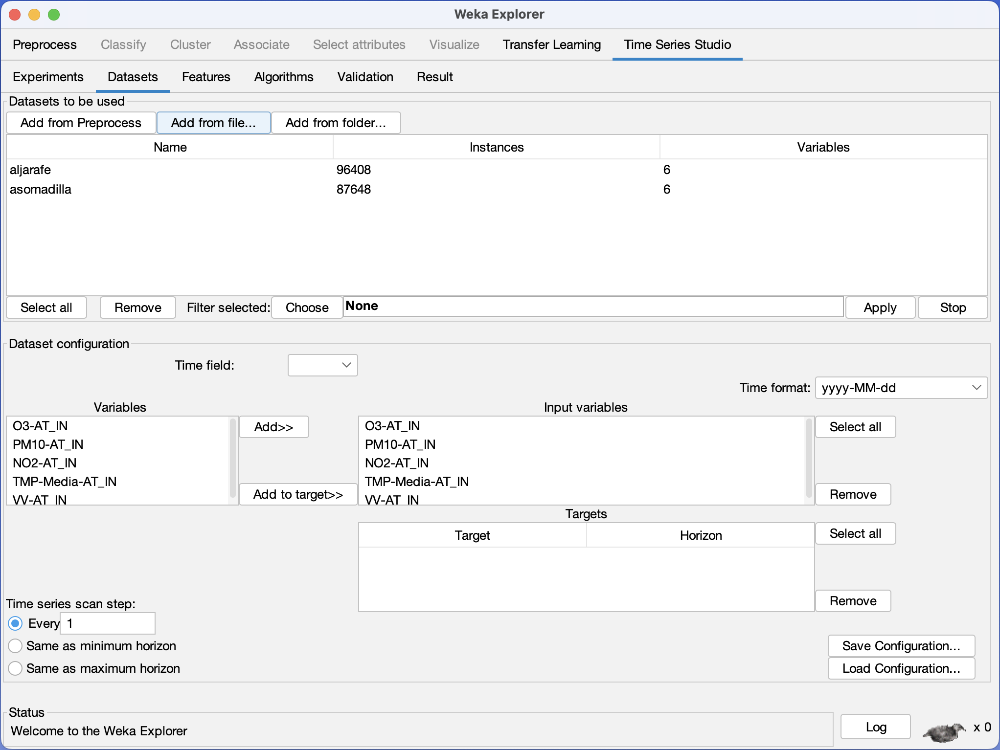
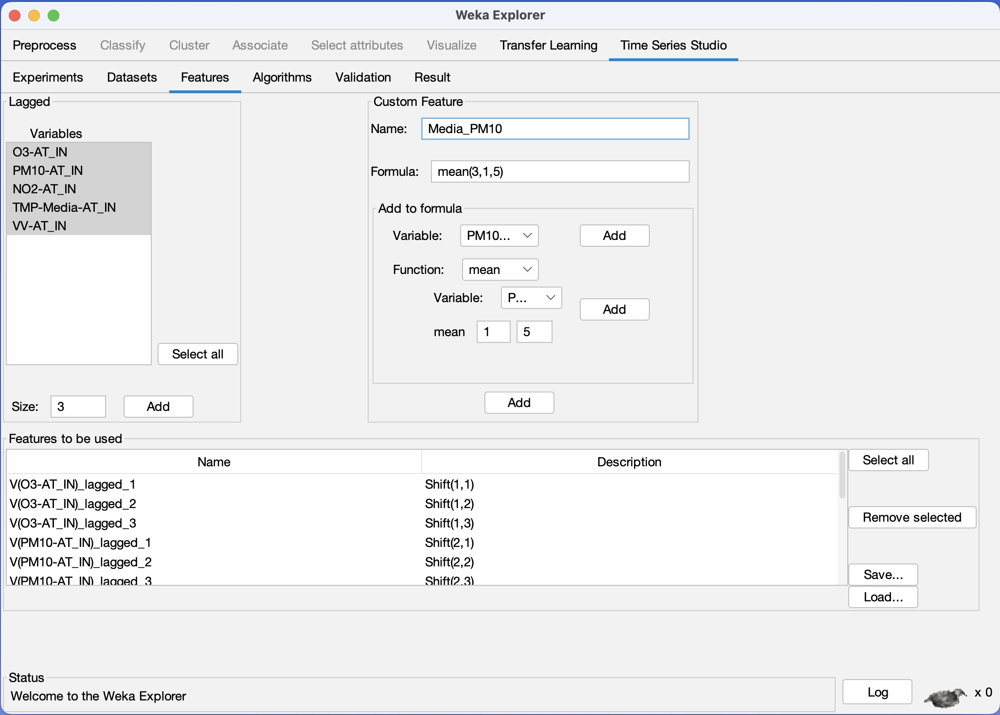

# Weka Time Series Studio
## A complete tool of time series forecasting analysis for Weka Explorer

New graphical user interface specifically designed to perform time series forecasting multi-dataset multi-horizon multi-algorithm analysis in Weka Explorer allowing parallel computation. Predicted and actual values are produced in an exportable table, including a vast set of validation types. Moreover, an exportable table of evaluation metrics are also produced, in addition to a customizable line plot.

Weka Time Series Studio allows the user to design its own features (feature engineering) based on formulas and predefined functions, along with the desired lagged variables.

Developed by: **Manuel Molina Fuentes** (for his final degree work)

Idea and supervision by: **Prof. Dr. Gualberto Asencio-Cortés** (final degree tutor)

2022 University of Pablo de Olavide. Seville, Spain

## Installation

1. Open the Package Manager of Weka (Tools menu in the first window).
2. Press the button File/URL
3. Write this address: https://github.com/gualbe/weka-time-series-studio/raw/main/ts-studio.zip
4. Press the OK button
5. Restart Weka

## User manual (in spanish)

https://github.com/gualbe/weka-time-series-studio/raw/main/TS-Studio-Manual.pdf

## Screenshots

The Datasets panel:

The Feature Engineering panel:

## Contact

Please contact with me at [My email](mailto:guaasecor@upo.es) if you have some comments or find some bugs.

Thank you!
